# ☕ Java & Bean Café Website

A Java Web Application deployed using Apache Tomcat on Ubuntu Server (VirtualBox)

---

## 📌 Project Overview

The *Java & Bean Café Website* is a dynamic Java web application that simulates an online café system where users can browse menu items, view products, and interact with the platform.

This project demonstrates the deployment of a Java-based web application using *Apache Tomcat* on an *Ubuntu Server running in a VirtualBox virtual machine*. It highlights server-side application hosting, shared folder integration, and web application deployment in a controlled virtual environment.

---

## 🚀 Features

- 📋 Dynamic café menu display  
- 🛒 Product browsing interface  
- 🔐 Backend design using Java (Servlets/JSP)  
- 🌐 Hosted inside Ubuntu VM via Apache Tomcat  
- 🗄️ Database connectivity (MySQL)  
- 🧑‍💼 Optional admin functionalities  

---

## 🖥️ System Architecture

### Frontend
- HTML, CSS, JavaScript  

### Backend
- Java Servlets & JSP (deployed on Apache Tomcat)  

### Database
- MySQL   

### Environment
- Ubuntu Server (VirtualBox VM)
- Apache Tomcat (Java Web Server)  

---

## 🧰 Technologies Used

- ☕ Java (JDK 8 or higher)  
- 🐧 Ubuntu Server  
- 📦 VirtualBox  
- 🛢️ MySQL  
- 💻 VS Code   
- 🔧 Git & GitHub  

---

## 📂 Project Structure

```
java-bean-cafe/
│── src/
│── webapp/ or WebContent/
│── WEB-INF/
│   └── web.xml
│── lib/
│── css/
│── js/
│── images/
│── database/
│── README.md
```

---

## 🧪 VM Setup & Deployment Guide (Ubuntu + Shared Folder)

### 🖥️ Step 1: Install Virtual Machine

1. Download and install VirtualBox  
2. Download Ubuntu Server ISO (20.04 or 22.04 LTS recommended)

---

### 🐧 Step 2: Create Ubuntu Server VM

1. Open VirtualBox → Click New  
2. Name: Ubuntu Server  
3. Type: Linux  
4. Version: Ubuntu (64-bit)  
5. RAM: at least 2GB  
6. Storage: 20GB (VDI, dynamically allocated)  

Then:

- Go to Settings → Storage  
- Attach Ubuntu ISO  

Start the VM and install Ubuntu:

- Choose Install Ubuntu Server  
- Set username, password, hostname  
- Install OpenSSH server  

Reboot after installation.

---

### 🔧 Step 3: Update System

```bash
sudo apt update
sudo apt upgrade -y
```

---

## 🌐 Hosting the Website in Ubuntu (Shared Folder Method)

### 📂 Step 4: Setup Shared Folder

1. Power off VM  
2. Go to Settings → Shared Folders  
3. Add:
   - Folder Path: your project folder  
   - Folder Name: ver2.0  
   - ✔ Auto-mount  
   - ✔ Make Permanent  
4. Start VM  

---

### 📁 Step 5: Access Shared Folder

```bash
cd /media
ls
```

Expected output:

```
sf_ver2.0
```

---

### ⚠️ If Permission is Denied

```bash
sudo usermod -aG vboxsf $USER
sudo reboot
```

After reboot:

```bash
cd /media/sf_ver2.0
ls
```

---

### 📦 Step 6: Access Website Files

```bash
cd /media/sf_ver2.0
ls
```

---

### ▶️ Step 7: Run Website (Python Server)

```bash
python3 -m http.server 8000
```

---

### 🌍 Step 8: Open in Browser

Inside VM:

```
http://localhost:8000
```

From host machine:

```
http://<VM-IP>:8000
```

Check IP:

```bash
ip a
```
---
# ☕ Apache Tomcat 10 + Java Setup & Deployment (Ubuntu)
This guide explains how to install Java, set up Apache Tomcat 10, compile Java Servlet files, and deploy a web application using a shared folder in Ubuntu.

---
### ☕ Step 1: Install Java (Required for Tomcat)
```bash
sudo apt update
sudo apt install openjdk-17-jdk -y
java -version
```
---

### 📥 Step 2: Install Apache Tomcat 10
```bash
sudo apt install tomcat10 -y
```
---

### 📦 Step 3: Move Project to Tomcat Directory
```bash
sudo cp -r /media/sf_ver2.0 /var/lib/tomcat10/webapps/myproject
```
---

### 📂 Step 4: Go to Project Source Folder (Inside Tomcat)
```bash
cd /var/lib/tomcat10/webapps/myproject/src
```
---

### 🧱 Step 5: Compile Java Servlet Files
```bash
javac -cp .:/usr/share/java/jakarta-servlet-api.jar -d ../WEB-INF/classes *.java
```
---

### 📁 Step 6: Ensure Proper Directory Structure
```
mkdir -p ../WEB-INF/classes
```
---

### ▶️ Step 7: Start and Enable Tomcat
```bash
sudo systemctl start tomcat10
sudo systemctl enable tomcat10
sudo systemctl status tomcat10
```
---

### 🔄 Step 8: Restart Tomcat
```bash
sudo systemctl restart tomcat10
```
### 🌐 Step 9: Access the Web Application
```bash
http://<VM-IP>:8080/myproject
```
or
```bash
http://localhost:8080/myproject
```
---
## 🗄️ Database Setup and Connection

---
## 📸 System Output

### 🏠 Homepage
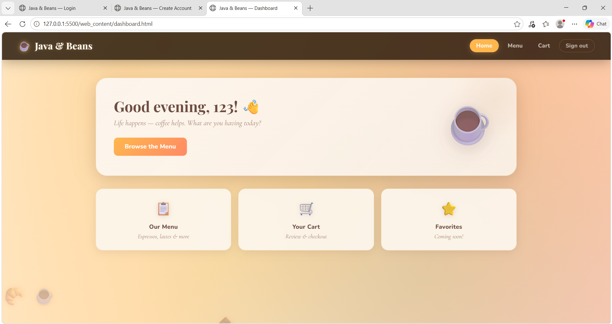

### 🔐 Login Page
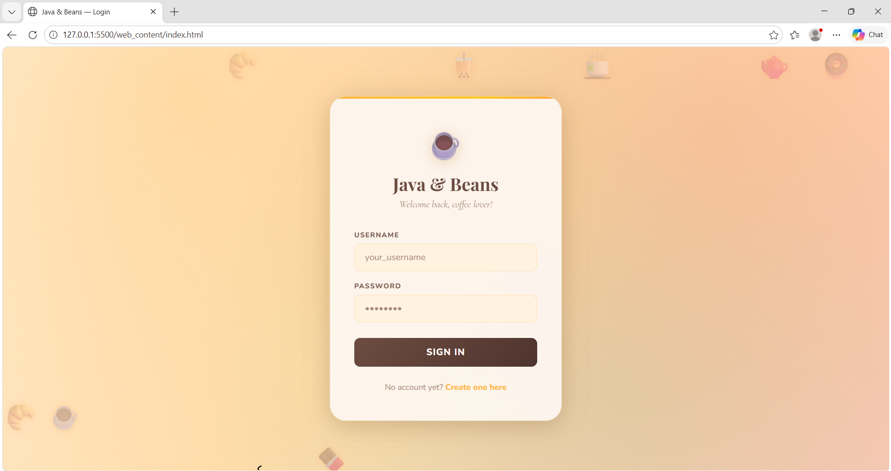

### 📝 Registration Page
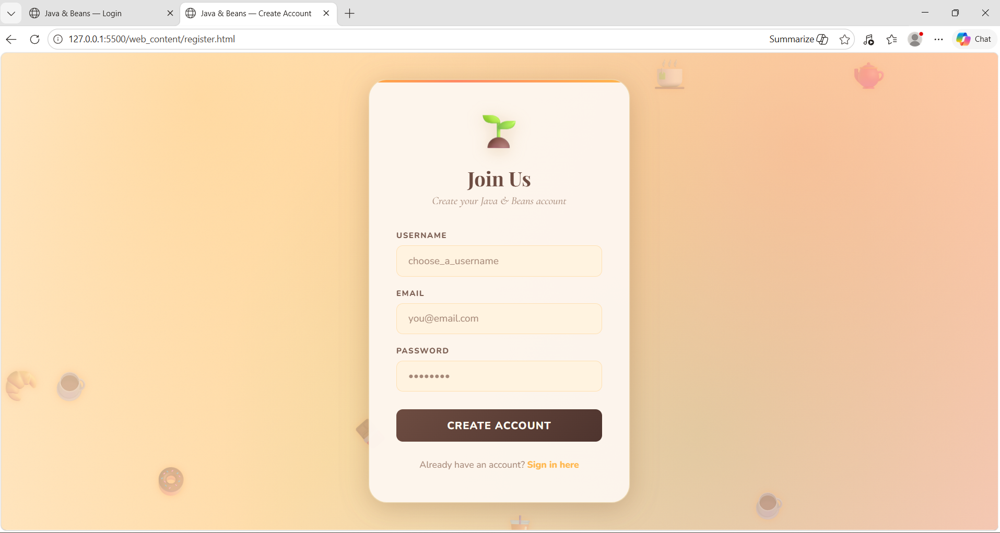

### 📋 Menu Page
**Menu View 1**
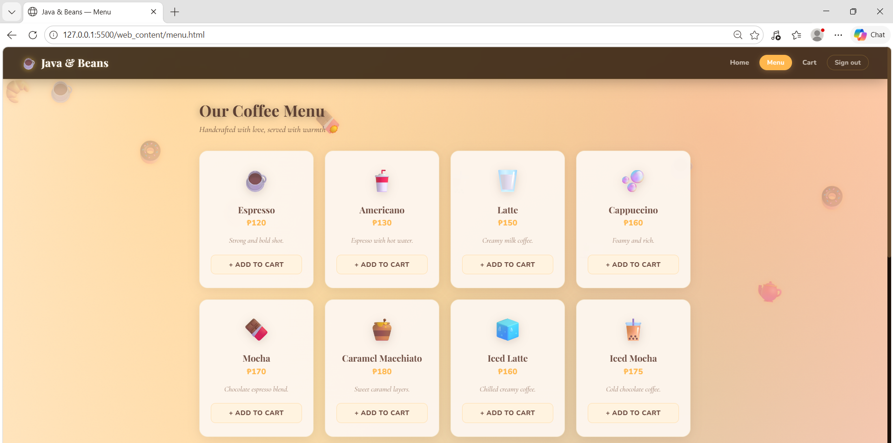

**Menu View 2**
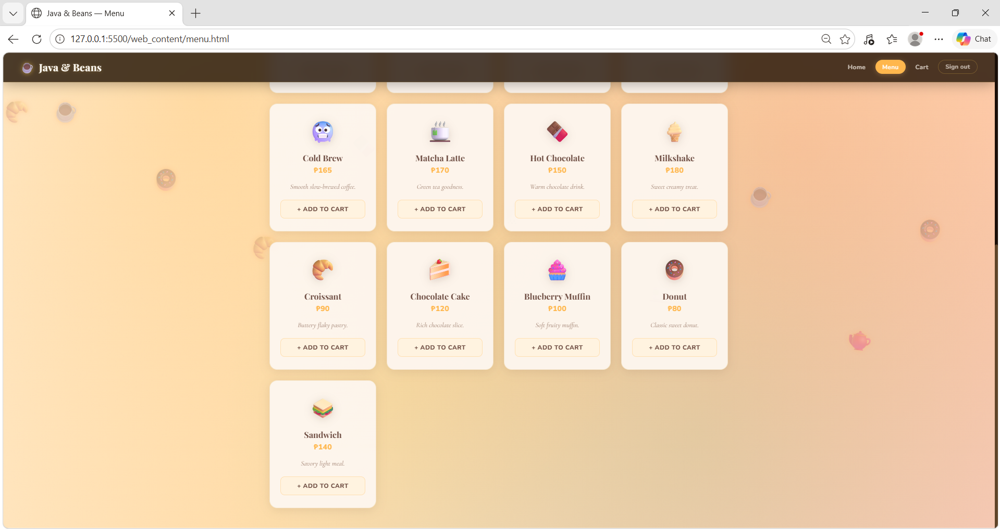

### 🛒 Cart
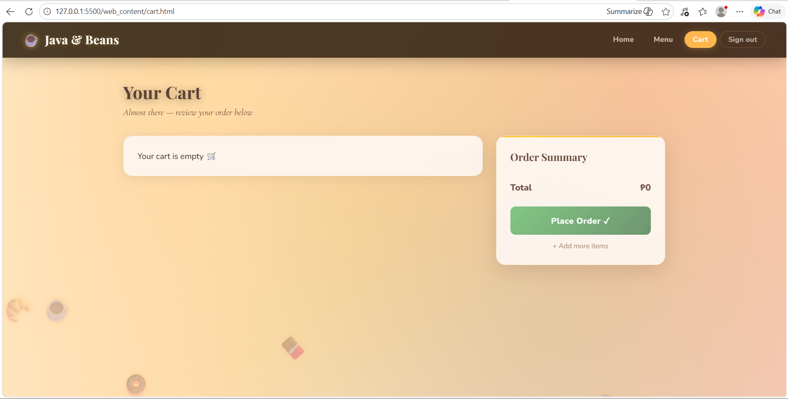

### 🧾 Cart with Orders
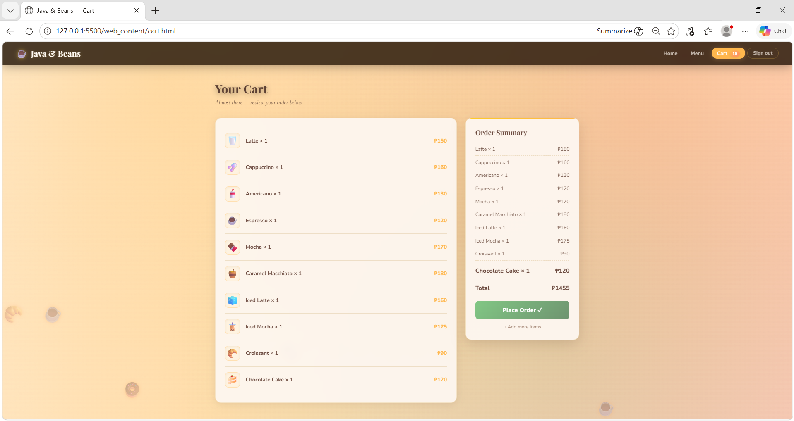

### 🌐 Application Running in Browser (Ubuntu)
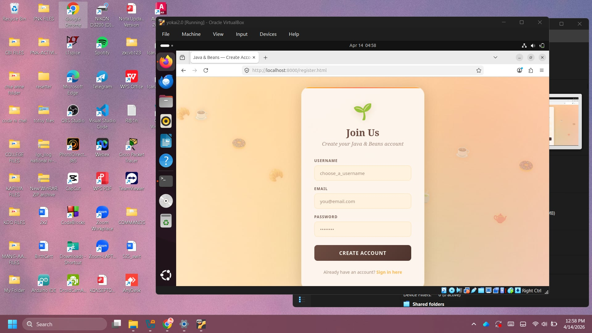
---

## 🌍 Cross-Device Testing

The system was successfully tested across multiple devices to ensure responsiveness and accessibility:

**📱iPhone (Safari)**
- 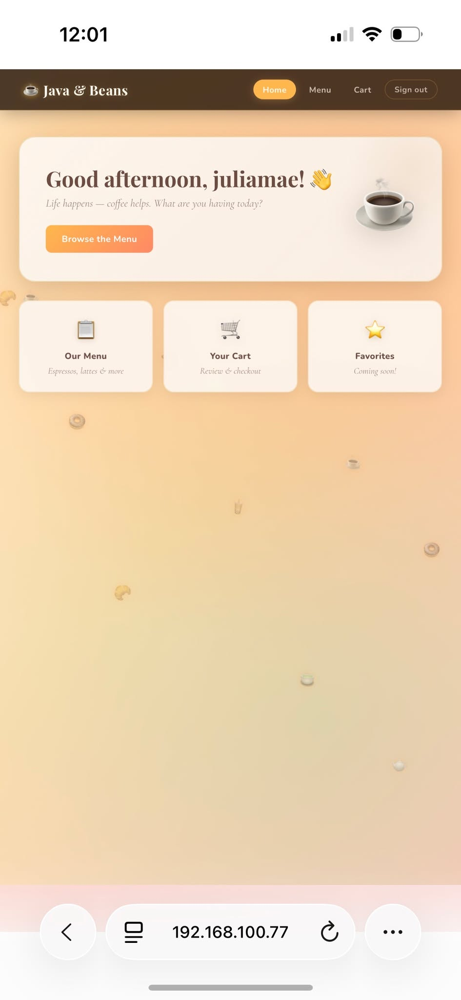

**🤖 Android (Chrome)**
- 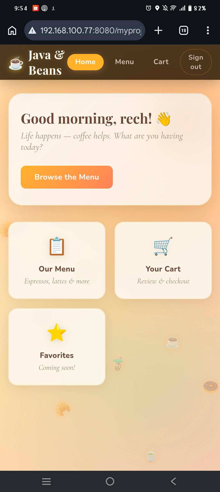

**💻 Laptop (Browser)**
- 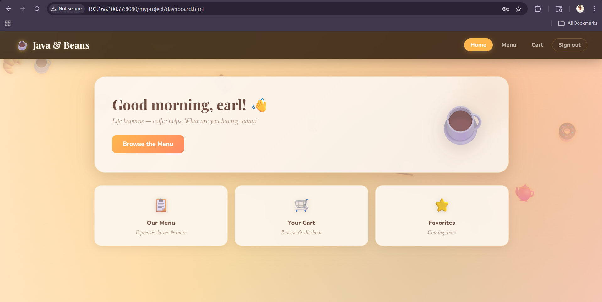

All devices were able to access the system using the VM IP address: (http://192.168.100.77:8080/myproject)

This confirms proper network configuration and server deployment.
---

## 🛠️ Troubleshooting (Struggles Encountered & Solutions)

### 1. Files Not Deployed to Tomcat
❌ Problem:  Project files were still in the shared folder: /media/sf_yokai2.0

💡 Cause:  Files were not copied to Tomcat’s deployment directory.

✅ Solution:
```bash
sudo cp -r /media/sf_yokai2.0 /var/lib/tomcat10/webapps/myproject
```

---

### 2. Permission Denied (Shared Folder)
❌ Problem:
Cannot access shared folder files

💡 Cause:
User not added to VirtualBox shared folder group

✅ Solution:
```bash
sudo usermod -aG vboxsf $USER
sudo reboot

```
---

### 3. Website Not Loading (Blank / 404)

❌ Problem:
Website not loading
Blank page or 404 error

💡 Causes:
Incorrect URL
Application not deployed correctly
Tomcat service not running

✅ Solution:
```bash
✔ Use correct URLs:
http://<VM-IP>:8080/
http://<VM-IP>:8080/myproject/

✔ Check Tomcat status:
sudo systemctl status tomcat10
✔ Restart Tomcat:

sudo systemctl restart tomcat10

```

--- 

### 4. Shared Folder Not Showing in /media
❌ Problem: Shared folder (sf_ver2.0) did not appear after mounting  

🔍 Cause: VirtualBox Guest Additions not
 properly configured  

 ✅ Solution:
```bash
sudo usermod -aG vboxsf $USER
sudo reboot
```

---

### 5. “No such file or directory” Error

❌ Problem: Directory not found when navigating

🔍 Cause: Incorrect folder path or folder name

✅ Solution:
```bash
ls
cd /media/sf_ver2.0
```
---

### 6. Java Compilation Errors

❌ Problem: Errors when compiling Java servlet files

🔍 Cause:Missing servlet API in the classpath

✅ Solution:
```bash
javac -cp .:/usr/share/java/jakarta-servlet-api.jar -d ../WEB-INF/classes *.java
```
--- 
 
### 7. 404 Error – Application Not Found

❌ Problem:
HTTP Status 404 – /myapp is not available

💡 Meaning:
Tomcat is running, but the application is not properly deployed.

### 🔍 Step-by-Step Fix
### 1. Check Deployment Directory
ls /var/lib/tomcat10/webapps

Expected:
```bash
myapp.war 
myapp/
```

If missing:
sudo cp myapp.war /var/lib/tomcat10/webapps/

### 2. Restart Tomcat
```bash
sudo systemctl restart tomcat10
```

### 3. Verify Extraction
```bash
ls /var/lib/tomcat10/webapps

```
Should show:
```bash
myapp/
myapp.war

```

If only .war exists:
WAR may be invalid
Structure may be incorrect

### 4. Check Project Structure
```bash
ls /var/lib/tomcat10/webapps/myapp/WEB-INF

```
Must contain:
web.xml
classes/

### 5. Fix Common Structure Errors
```bash

Wrong:
│── myapp/
│   └── myapp/
│      └── WEB-INF/

Correct:
│── myapp/
│   └── WEB-INF/

```

### 6. Use Correct URL
```bash
http://localhost:8080/myapp

```

Do NOT use:
/myapp.war

### 7. Check Logs (If Still Failing)
```bash
sudo journalctl -u tomcat10

```

### 8. Test Tomcat Server
```bash
http://localhost:8080

```

If it loads → Tomcat is working
If not → server configuration issue

---
## 🛠️ Database Troubleshooting


---
## 🔐 Security Considerations

- Use strong database credentials  
- Restrict access to sensitive files  
- Avoid running services as root  
- Keep Ubuntu updated  


---

## 👨‍💻 Author

Developed by: 
Janella Frenzyle I. Aggay
Earl Justine S. Bacting
Rechelle C. Mercader
Kimberly A. Monserrat
Julia Mae E. Sampaga 

---

## 📄 License

This project is for educational purposes only.
