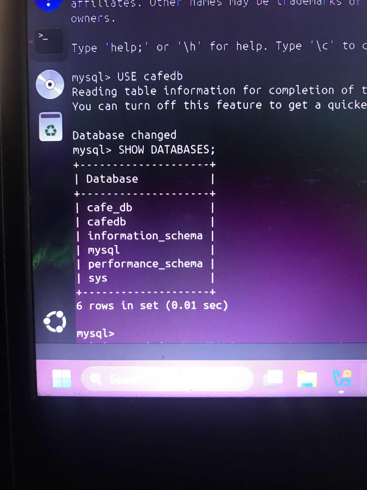

# ☕ Java & Bean Café Website

A Java Web Application deployed using Apache Tomcat on Ubuntu Server (VirtualBox)

---

## 📌 Project Overview

The *Java & Bean Café Website* is a dynamic Java web application that simulates an online café system where users can browse menu items, view products, and interact with the platform.

This project demonstrates the deployment of a Java-based web application using *Apache Tomcat* on an *Ubuntu Server running in a VirtualBox virtual machine*. It highlights server-side application hosting, shared folder integration, and web application deployment in a controlled virtual environment.

---

## 📌 Features

- User registration with email validation and password strength meter
- Secure login with server-side session authentication
- Café menu loaded dynamically from the database via `MenuServlet`
- Cart system with atomic order transactions and rollback support
- MariaDB integration with full `InnoDB` relational schema

---

## 🔐 Security

- Passwords hashed with SHA-256 and a random salt via `PasswordUtil.java` — never stored as plain text
- All database queries use `PreparedStatement` — no SQL injection possible
- Server-side `HttpSession` authentication on all protected servlet endpoints
- Specific DB constraint violation handling with full transaction rollback on order failure
- Input validation on both client (email regex, password strength meter) and server (Java)
- All 4 servlets mapped in `web.xml` with `HttpOnly` session cookies and a 60-minute timeout

---

## 🧰 Technologies Used

| Layer | Technology |
|-------|-----------|
| Frontend | HTML, CSS, JavaScript |
| Backend | Java Servlets — `RegisterServlet`, `LoginServlet`, `MenuServlet`, `OrderServlet` |
| Server | Apache Tomcat 10 |
| Database | MariaDB / MySQL (`cafeDB`) |
| JDBC Driver | `mariadb-java-client.jar` |
| Environment | Ubuntu Server on VirtualBox VM |

---

## 🖥️ System Architecture

### Frontend
- HTML, CSS, JavaScript
### Backend
- Java Servlets & JSP (deployed on Apache Tomcat)
### Database
- MariaDB — `cafeDB` with 4 tables: `users`, `menu`, `orders`, `order_items`
### Environment
- Ubuntu Server (VirtualBox VM)
- Apache Tomcat 10 (Java Web Server)
- 
---


## 📂 Project Structure

```

java-bean-cafe/
├── index.html               ← Login page
├── register.html            ← Registration page
├── dashboard.html           ← Home (after login)
├── menu.html                ← Browse menu items
├── cart.html                ← Cart & checkout
├── style.css                ← All styles
├── script.js                ← All frontend logic
├── WEB-INF/
│   ├── web.xml              ← Servlet mappings, session config
│   ├── lib/                 ← Place mariadb-java-client.jar here
│   └── classes/             ← Compiled .class files go here
├── scr/
│   ├── DBConnection.java
│   ├── PasswordUtil.java
│   ├── RegisterServlet.java
│   ├── LoginServlet.java
│   ├── MenuServlet.java
│   └── OrderServlet.java
└── sql/
    └── cafeDB_setup.sql     ← Database schema + sample menu data

```

---

### 📸 System Output

### 🏠 Homepage

### 🔐 Login Page

### 📝 Registration Page

### 📋 Menu Page
**Menu View 1**

**Menu View 2**

### 🛒 Cart

### 🧾 Cart with Orders


### 🌐 Application Running in Browser (Ubuntu)

### 🗄️ Sample Database Output


---

## 🌍 Cross-Device Testing

The system was successfully tested across multiple devices to ensure responsiveness and accessibility:
**📱iPhone (Safari)**
- 

**🤖 Android (Chrome)**
- 

**💻 Laptop (Browser)**
- 

All devices were able to access the system using the VM IP address: (http://192.168.100.77:8080/myproject)
This confirms proper network configuration and server deployment.

---

## 👨‍💻 Author

Developed by: 
Janella Frenzyle I. Aggay
Earl Justine S. Bacting
Rechelle C. Mercader
Kimberly A. Monserrat
Julia Mae E. Sampaga 

---

## 📄 License

This project is for educational purposes only.
